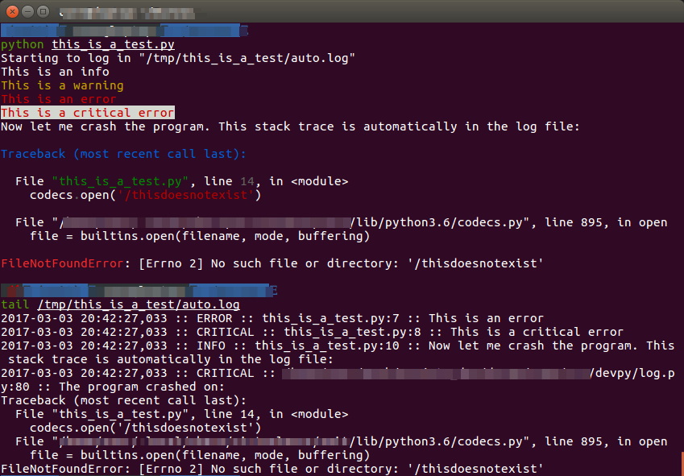

DEVPY
-----

Devpy is a set of tools to ease Python development.

Install
=========

::

    pip install devpy

Quick demo
===========

Devpy provides a quick dev setup for logging that you can replace later by a more robust solution:

.. code:: python

    import devpy.develop as log

    log.info('This is an info')
    log.warning('This is a warning')
    log.error('This is an error')
    log.critical('This is a critical error')

    log.info('Now let me crash the program. This stack trace is automatically in the log file:')

    import codecs

    codecs.open('/thisdoesnotexist')

This gives:

Autolog
========

Setting up proper logging is tedious, so you may want to do it later, but you wish you could get basic logging right away:

.. code:: python

    import devpy

    # Get a logger that automatically logs to console and a rotating file
    # The rotating file is setup in the temp directory of your system, in
    # a subdir named after your script name.
    # Logs are colored in the console according to their level.
    # The file path is printed at the beginning of the program.

    log = devpy.autolog() # log is a regular stdlib logger object

    # start logging:

    log.info('Yes')

Once you have time to setup logging seriously, you can just replace the autolog with a regular custom Python logger, and all your logs will still work.

Setting the environment variable DEVPY_LOG_LEVEL to an integer or a level name (debug, info, error, warning, critical...) will set the autolog log to it.

Setting the environment variable DEVPY_COLOR_LOG to 0 disables log highlighting.

autolog parameters:

- level (default=-1): the general log level
- name (defaul=name of the root module): the name of the log file
- path (default=OS temp dir + name): path to the log file
- log_on_crash (default=True): add a hook to log the stack trace in case of a crash
- log_filename (default=True): log log file path at the program start
- color_log (default=True): add colors to the log

Stacktrace helper
=================

Format the stack trace so that:

- it separates the various logicial blocs
- it emphasizes the lines of your program and not the stdlib
- lines of your program are syntax highlighted

Just do:

.. code:: python

    import devpy
    devpy.color_traceback()

All helpers at once
===================

Two ways:

.. code:: python

    import devpy
    log = devpy.dev_mode()  # can set color_traceback=True, autolog=True

    # or just
    # import devpy.develop as log
    # for a one liner to activate it all

